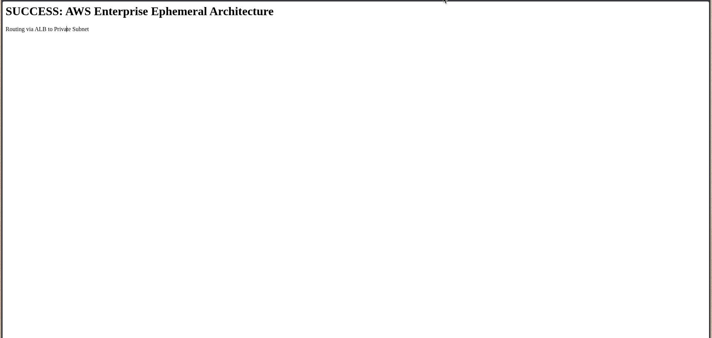
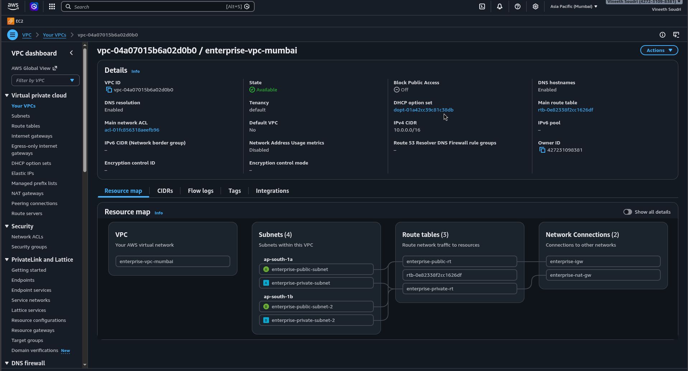

# Enterprise AWS Architecture via Terraform

### 🚀 What This Project Does
This project uses Infrastructure as Code (Terraform) to automatically build, monitor, and destroy a secure, enterprise-grade cloud environment in AWS. 

Instead of just spinning up a random server, it builds a complete, production-ready traffic flow:
1. **The Front Door:** An Application Load Balancer (ALB) sits in a public network zone, receiving web traffic from the outside world.
2. **The Secure Servers:** The ALB routes traffic securely to an Nginx Web Server (EC2) hidden inside a Private Subnet.
3. **The Data Vault:** The web server connects to a private PostgreSQL Database and a Redis Cache, which are completely cut off from the public internet.
4. **The Security Camera:** Amazon CloudWatch continuously monitors the server's CPU. If it spikes above 70%, it triggers an SNS alarm that immediately sends an email alert to the administrator.
5. **The Drawbridge:** A secure Bastion Host allows the administrator to safely SSH into the private backend servers for maintenance.

### 🛠️ Tech Stack
* **Cloud:** AWS (VPC, EC2, ALB, RDS, ElastiCache, NAT Gateway)
* **Infrastructure as Code:** Terraform (Strict Modular Architecture)
* **Observability:** CloudWatch & Simple Notification Service (SNS)
* **Web Server:** Nginx (Deployed via automated bash scripts)

### 📸 Proof of Execution

**1. Live Web Server Routing:**

**2. VPC Resource Map:**

